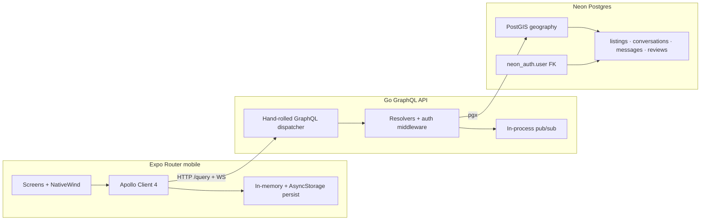
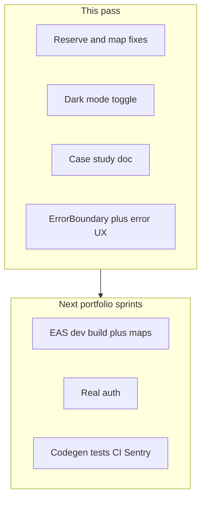

# Harvest — Development Case Study

A portfolio write-up of building **Harvest**: a hyperlocal surplus-food app where neighbors and small businesses post time-sensitive listings for nearby pickup.

Product brief: [`Harvest-PRD.md`](./Harvest-PRD.md) · Visual language: [`DESIGN_SYSTEM.md`](./DESIGN_SYSTEM.md) · Runbook: [`SETUP_GUIDE.md`](./SETUP_GUIDE.md)

---

## 1. Problem & product

Households and cafés throw away edible food while neighbors a few blocks away could use it. Charity logistics are too heavy for “twelve croissants tonight,” and general marketplaces lack pickup windows, expiry, and food-specific trust.

Harvest is a **hyperlocal mobile MVP**: post surplus with a photo and pickup window, discover nearby listings (list first; map behind a native build), reserve atomically, coordinate in chat, then rate after pickup.

---

## 2. Architecture

| Layer | Choice |
|-------|--------|
| Client | Expo Router (SDK 54), React Native, NativeWind v4, Apollo Client 4 |
| API | Go + custom GraphQL operation dispatch (same resolver surface as a future gqlgen cutover) |
| Data | Neon Postgres + PostGIS; profiles keyed to Neon Auth user ids |
| Auth (local) | Demo JWT (`Authorization: Bearer`) so Expo Go can exercise reserve/chat without OTP |

---

## 3. Stack choices & tradeoffs

| Decision | Why | Tradeoff |
|----------|-----|----------|
| **Expo Go first** | Fast iteration on UI, GraphQL, and flows without EAS binaries | Native Mapbox does not ship in Expo Go → map is gated behind a development build |
| **NativeWind** | Design-system tokens as Tailwind classes; light/dark via `dark:` | Requires `darkMode: 'class'` + `colorScheme.set` for an in-app Appearance control |
| **Apollo 4** | Normalized cache, auth/error links, subscriptions-ready | Peer ecosystem lagged (e.g. cache persist) → small custom AsyncStorage persist |
| **Hand-rolled GraphQL dispatch** | Ship a working API quickly without codegen ceremony | No automatic schema→Go types; roadmap includes gqlgen / `graphql-codegen` |
| **Jittered `display_location`** | Privacy until reservation unlocks exact coords | Slight UX fuzz on the map/list distance |

---

## 4. Schema & geo queries

Listings store `true_location` and public `display_location` as PostGIS geography points. Nearby discovery uses **`ST_DWithin`** (and distance ordering) so the feed stays hyperlocal and index-friendly.

Reservation is an **atomic SQL update**: only `ACTIVE` rows where `owner_id != reserver` flip to `RESERVED`, then a conversation + participants are created. That prevents double-booking and self-reservation without app-only checks.

---

## 5. Auth evolution

1. **Supabase OTP** — original PRD path (email magic / OTP).  
2. **Neon FK** — migrations retargeted from Supabase `auth.users` / RLS to Neon (`neon_auth."user"`) so the schema runs on Neon.  
3. **Demo JWT** — local Expo Go path: “Continue as demo neighbor” stores a signed-shaped JWT; Apollo’s `SetContextLink` attaches `Authorization: Bearer …` after `ensureAuthTokenLoaded()`.

Production Play Store path: restore Neon Auth or Supabase with secure token storage and refresh (see roadmap P0).

---

## 6. Key screens & flows

1. **Onboard** → value prop → **Auth** (demo or OTP when configured)  
2. **Home / Browse** → nearby listings (seeded Lisbon coords via env for demos)  
3. **Listing detail** → reserve (blocked for own listings) → conversation  
4. **Inbox / Chat** → coordinate pickup  
5. **Confirm pickup** → rating prompt  
6. **Profile** → radius, **Appearance (Light / Dark / System)**, sign out  

---

## 7. Challenges solved

- **Dependency / peer hell** — Apollo 4 vs older persist packages; replaced with a thin cache write→AsyncStorage debounce.  
- **Expo Go vs SDK lag** — pinned to SDK 54 so store Expo Go matches; Mapbox remaining native-only.  
- **Map toggle crashes** — JS `require('@rnmapbox/maps')` can succeed while native is missing; `getMapbox()` now treats Expo Go (`appOwnership === 'expo'`) and missing native modules as unavailable and never mounts `MapView`.  
- **Reserve failures** — missing auth header timing + demo user reserving **own** seed listings (`RowsAffected == 0`); fixed with token warm-up, owner UI copy, and GraphQL-aware error alerts.  
- **RLS / Neon migration** — dropped Supabase-only policies; kept PostGIS + app-enforced authorization in resolvers.

---

## 8. What you’d ship next for Play Store

1. **EAS Development Build** + Mapbox token + store signing  
2. **Real auth** (Neon Auth / Supabase) replacing demo JWT  
3. **CI** (lint, typecheck, a couple of RN Testing Library flows) + **Sentry**  
4. Privacy policy, food-safety copy, and moderation basics  
5. **EAS Submit** to Play Console  

See the prioritized table below.

---

## 9. Setup / run

Follow [`SETUP_GUIDE.md`](./SETUP_GUIDE.md) for env files, migrations, and running the Go API + Expo app. For local demos without OTP, use **Continue as demo neighbor**, point `EXPO_PUBLIC_GRAPHQL_URL` at your LAN API, and set seed lat/lng to match `0002_seed.sql`.

---

## Skills demonstrated

| Hireable keyword | Where it shows up |
|------------------|-------------------|
| React Native / Expo Router | Tab chrome, modals, deep links to listing/chat |
| Typed API clients | Apollo operations, auth/error links, cache persistence |
| Postgres / PostGIS | Nearby queries, geography columns, atomic reserve |
| Auth | JWT middleware, demo session, migration off Supabase RLS |
| Offline-ish cache | Apollo store + AsyncStorage restore |
| Design systems | Tokens, NativeWind, Fraunces/Inter, light/dark |
| Product engineering | Error boundaries, structured mutation UX, Expo Go vs native tradeoffs |

---

## Feature roadmap (industry patterns)

**Shipped in this pass**

| Pattern | Implementation |
|---------|----------------|
| Error boundary + recovery UI | `mobile/components/ErrorBoundary.tsx` at root |
| Structured mutation/error UX | `mobile/lib/errors.ts` + Apollo `ErrorLink` logging |
| Theme control | Profile Appearance + NativeWind `colorScheme.set` |
| Defensive map gating | Expo Go never mounts Mapbox |

**Prioritized for later sprints**

| Priority | Feature | Industry pattern you’ll learn |
|----------|---------|-------------------------------|
| P0 | EAS Development Build + Mapbox | Custom native modules, `expo-dev-client`, store-bound binaries |
| P0 | Real auth (Neon Auth or Supabase) replacing demo JWT | OAuth/OTP, secure token storage, refresh |
| P1 | GraphQL codegen (`graphql-codegen`) | End-to-end typed operations |
| P1 | Jest + React Native Testing Library + 1–2 flow tests | Testable UI, CI-ready confidence |
| P1 | GitHub Actions CI (lint/typecheck/test) | Professional delivery pipeline |
| P1 | Sentry (or similar) crash reporting | Production observability |
| P2 | Zod forms (post listing) | Runtime validation, safer forms |
| P2 | Push notifications (expo-notifications end-to-end) | Permissions, tokens, deep links |
| P2 | Optimistic UI + cache updates on reserve | Apollo cache mastery |
| P2 | Accessibility pass (labels, contrast, hit targets) | A11y as product quality |
| P3 | Play Store listing + EAS Submit | Release engineering |
| P3 | Analytics (privacy-respecting events) | Product instrumentation |

